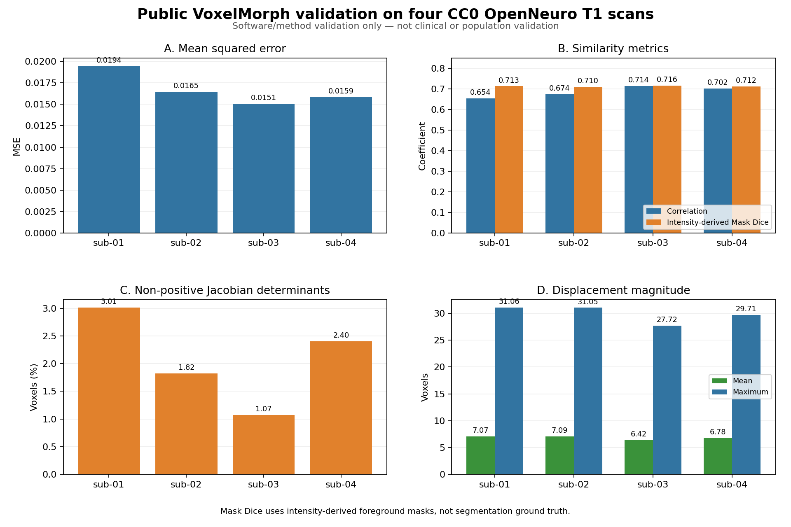

# VoxelMorph Preprocessing Robustness

## A Silent Dtype Failure Case Study in MRI Registration

This repository documents and tests a preprocessing failure mode in which an
intensity-scaled registration can finish without an explicit error while
integer NIfTI storage quantizes the resampled image. Converting the moving image
to `float32` before registration prevents this storage-level failure.

The project is not the upstream VoxelMorph implementation, a classifier, a new
registration architecture, or a clinical-validation study. Its contribution is
an auditable implementation of dtype guards, intensity quality control,
single-pass VoxelMorph inference, synthetic regression tests, and a public
smoke demo based only on official upstream example assets.

The failure was initially observed during work with controlled-access imaging
data. No raw or derived participant-level data, measurements, figures, paths,
identifiers, or session-level results from that work are distributed here.

## The silent dtype failure

With intensity scaling enabled, registration may produce small floating-point
values. If the transformed image is written using integer storage, rounding can
collapse those values into a small number of discrete levels. The transform can
still be written, the image can remain readable, and the process can exit
successfully, making this a silent data-quality failure rather than a crash.

The production path therefore converts the skull-stripped moving image to
`float32` before intensity-scaled registration and rejects integer-stored inputs
at both registration and VoxelMorph boundaries.

## What is preserved and tested

- Controlled `int16` versus `float32` ablation tooling for authorized local use.
- Fail-fast checks for dtype, finite values, constant images, low value diversity,
  and extreme foreground sparsity.
- Rigid, affine, and deformable-stage QC using MSE, correlation,
  intensity-derived foreground-mask Dice, displacement, and Jacobian summaries.
- Single-pass extraction of the moved image and final full-resolution warp from
  the same VoxelMorph graph execution.
- Synthetic tests that reproduce integer quantization without research data.
- A public upstream smoke demo that requires no ADNI input.

## Pipeline overview

```text
DICOM or NIfTI input under an applicable data agreement
  -> skull stripping
  -> float32 conversion + quality gate
  -> rigid registration
  -> affine registration
  -> pretrained VoxelMorph deformation
  -> numerical + visual QC performed locally
```

Public CI does not execute the controlled-data workflow.

## Validated software environment

- Python 3.10.21
- TensorFlow 2.15.1
- VoxelMorph commit `75ac2a2cd7298af3b3d563a3f0cfa000e410d099`
- FreeSurfer 8.2.0 for the optional full preprocessing workflow
- Model filename `vxm_dense_brain_T1_3D_mse.h5`
- Model SHA-256 `8e5fe6bcbca68b4fa867864460315fdaa7e00139cd522379cea79db5e63a9e3c`

## Repository layout

```text
.
├── .github/workflows/tests.yml
├── data/README.md
├── docs/
│   ├── FAILURE_ANALYSIS.md
│   ├── METHODS.md
│   ├── RESULTS.md
│   └── TROUBLESHOOTING.md
├── models/README.md
├── reports/
│   ├── public_demo/public_demo_metrics.json
│   └── public_validation/
├── figures/public_validation/
├── scripts/
│   ├── audit_nifti.py
│   ├── prepare_atlas.py
│   ├── plot_public_validation.py
│   ├── preprocess_session.py
│   ├── run_dtype_ablation.py
│   ├── run_public_demo.py
│   ├── run_voxelmorph.py
│   └── validate_public_artifacts.py
├── src/voxelmorph_pipeline/
│   ├── inference.py
│   ├── io_utils.py
│   ├── metrics.py
│   ├── naming.py
│   └── quality.py
└── tests/
    └── test_public_validation_artifacts.py
```

## Installation

```bash
uv python install 3.10.21
uv venv --python 3.10.21 .venv
source .venv/bin/activate
uv pip install --link-mode=copy -r requirements.txt
uv pip install --link-mode=copy -e . --no-deps
```

FreeSurfer and `dcm2niix` are external requirements for the optional full
preprocessing workflow, not for the lightweight tests.

## Obtain public upstream assets

The repository does not redistribute the model, atlas, test scan, or their
licenses. Download the official example NPZ files associated with the pinned
VoxelMorph commit:

```bash
curl -fL -o atlas.npz \
  https://raw.githubusercontent.com/voxelmorph/voxelmorph/75ac2a2cd7298af3b3d563a3f0cfa000e410d099/data/atlas.npz
curl -fL -o test_scan.npz \
  https://raw.githubusercontent.com/voxelmorph/voxelmorph/75ac2a2cd7298af3b3d563a3f0cfa000e410d099/data/test_scan.npz
```

Download and verify the model as described in
[`models/README.md`](models/README.md). If the hosting server times out, use a
browser and retry later rather than accepting an incomplete download.

## Prepare the atlas for the optional NIfTI workflow

```bash
python scripts/prepare_atlas.py \
  --atlas-npz /path/to/atlas.npz \
  --reference "$FREESURFER_HOME/subjects/fsaverage/mri/orig.mgz" \
  --output-t1 /path/to/generated/atlas_T1w.nii.gz \
  --output-seg /path/to/generated/atlas_seg.nii.gz
```

The upstream NPZ does not contain a NIfTI affine. The `orig.mgz` reference
provides geometry for the documented `fsaverage` crop convention; it is not
scanner metadata supplied by the NPZ.

## Public reproducibility demo

```bash
python scripts/run_public_demo.py \
  --model /path/to/vxm_dense_brain_T1_3D_mse.h5 \
  --atlas-npz /path/to/atlas.npz \
  --test-scan-npz /path/to/test_scan.npz \
  --output-dir outputs/public_demo
```

Pass `--cpu` when no TensorFlow GPU is available. The demo uses one neural
forward pass and reports MSE plus mean nonzero-label Dice before and after
registration. It does not contain hard-coded expected scores. The committed
summary in [`reports/public_demo/public_demo_metrics.json`](reports/public_demo/public_demo_metrics.json)
was generated from the official public inputs and records its provenance.

This demo is a software smoke test, not anatomical validation, clinical
validation, or a population benchmark.

## Public-data validation

The independent public-data validation uses four public T1-weighted scans from
OpenNeuro `ds005125` v1.0.0. Each scan was registered to the VoxelMorph atlas
with the atlas grid, after affine-derived reorientation, linear resampling, and
robust nonzero min-max scaling to `[0, 1]`. Metrics and the figure below come
only from these four real executions:



- [Validation README](reports/public_validation/README.md)
- [Measured metrics](reports/public_validation/public_validation_metrics.json)
- [Sanitized manifest](reports/public_validation/public_validation_manifest.json)
- [Metrics figure](figures/public_validation/public_validation_metrics.png)

This is software/method reproducibility validation, not clinical validation or
population-level generalization. The earlier ADNI experiment remains a
separate, limited, unchanged case study; its data and participant-level
results are not published. Raw MRI, model weights, atlas, warp fields, and
work outputs are not included in GitHub. This public validation complements,
and does not replace, the ADNI case study.

## Controlled dtype ablation

`scripts/run_dtype_ablation.py` preserves the controlled comparison between
integer-stored and floating-point moving images. It is intended for data that
the user is authorized to process locally. Its experiment directory is ignored
by Git, and its participant-level outputs must not be committed or published.

The public synthetic tests exercise the same quantization guard without using
controlled-access data:

```bash
uv pip install --link-mode=copy -r requirements-test.txt
pytest
```

## Audit a NIfTI image locally

```bash
python scripts/audit_nifti.py image.nii.gz --fail-on-warning
```

Exit code `2` means that the selected quality policy rejected the image.

## Quality-control boundaries

No single metric proves registration correctness. MSE and correlation measure
intensity similarity; intensity-derived foreground-mask Dice is not anatomical
segmentation Dice. Positive Jacobian determinants do not independently prove
anatomical plausibility, and differences between longitudinal warps must not be
interpreted as atrophy or clinical change.

## Data and model availability

ADNI data and all participant-level raw or derived outputs are excluded from
this repository. MRI volumes, DICOM files, screenshots, transforms, deformation
fields, local QC reports, model weights, and atlas arrays are not distributed.
Users are responsible for obtaining external assets under their applicable
licenses and data-use agreements.

## Reproducibility limits

- Public CI runs lightweight synthetic tests and artifact validation only.
- Full preprocessing requires external tools and user-supplied authorized data.
- The public demo validates execution on upstream example assets only.
- The repository makes no diagnostic, treatment, atrophy, or other clinical claim.
- Internal controlled-data observations are described only at the mechanism level.

See [Methods](docs/METHODS.md), [Public Results](docs/RESULTS.md),
[Failure Analysis](docs/FAILURE_ANALYSIS.md), and
[Troubleshooting](docs/TROUBLESHOOTING.md).

## Citation

Citation metadata are provided in [`CITATION.cff`](CITATION.cff). Please also
cite the upstream VoxelMorph, SynthStrip, and robust-registration methods when
they are used.

## License

Original code and documentation in this repository are released under the
[MIT License](LICENSE). This license does not apply to ADNI data, upstream model
weights, atlases, example assets, or third-party software.
